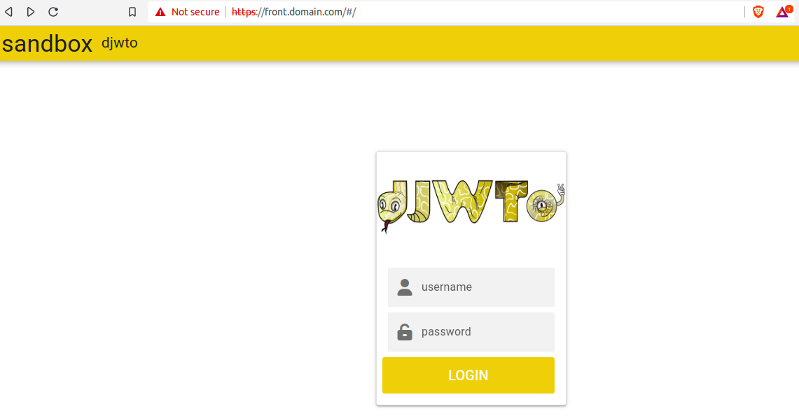
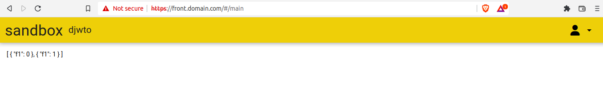
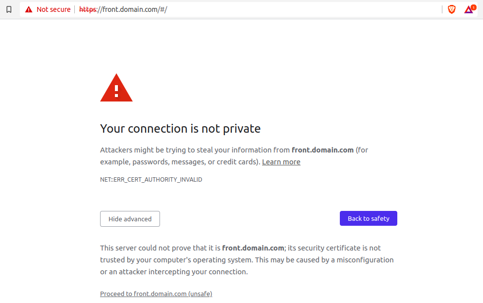

# SandBox (frontend)

Sandbox environment to play around with djwto. It has an initial login page:



And a page with dummy data to confirm login and permission worked as expected:





### Start the frontend app in development mode

Go to the `frontend` folder and run:

```bash
yarn quasar dev
```

The service should be running at localhost:9000


### Start the backend app

On the `backend` folder, install the dependencies by running:

    pip install -r requirements.txt

Those will allow running the server behind TLS and set the necessary headers for CORS between frontend and back.

On Linux, for testing cross-domain requests, add to `/etc/hosts` the lines:

    127.0.0.1 example.com
    127.0.0.1 api.example.com

The first will route frontend and the latter the data server.

Run the migrations if necessary (at folder backend where `manage.py` is located):

    python manage.py makemigrations
    python manage.py migrate

There's already a script ready to create a user "alice" in folder `bin`:

    cd bin && python add_default_user.py

Then start the server:

    export DJWTO_SIGNING_KEY='test key' && python manage.py runsslserver 0.0.0.0:8002

Open your browser at `https://example.com:9000` and you should see a simple interface (probably it'll first block the connection saying it's a self-signed cert, accept it and proceed anyways):



When trying to connect the backend server might be blocked as well. Visiting `https://api.example.com:8002` and also accepting the self-signed connection will make things work.

The user is "alice" with "pass" as password. The user "bob" also exists but has not permission to see the data.

## Docker

A docker-compose file is also available to run djwto on a app behind nginx. Just run (inside sandbox folder) `docker compose up` and access your browser on `https://front.domain.com`. Notice that it's required to accept the self-signed certificates (including `https://back.domain.com`).
